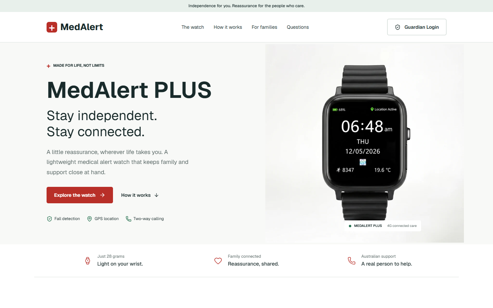

# MedAlert + Guardian

A product-led homepage and connected-care dashboard, built as a focused MedAlert hiring-challenge prototype.

**[Explore the live demo](https://medalert-guardian-challenge.vercel.app)** | **[Open Guardian](https://medalert-guardian-challenge.vercel.app/login)**

`Next.js` / `React` / `TypeScript` / `CSS` / `Lucide` / `Vercel`



> **Demo only:** all wearer and device information is fictional. No emergency services are connected. Please do not enter real credentials or personal information.

## Take a Look

Select **Use demo credentials** on the login screen, or enter:

| Email                | Password      |
| -------------------- | ------------- |
| `demo@medalert.test` | `Guardian72!` |

The flow covers a responsive homepage, validated login with success and failure states, and Margaret Thompson's dashboard. Device information comes from a server-side API, with **status refresh and recent activity** as the additional Guardian features.

### Homepage Expansion

The current homepage also includes a watch photo gallery, product features, setup steps, a responsive Guardian preview, expandable FAQs, and official support links. Sticky navigation and a mobile menu connect the sections.

**This expansion was added after the timed challenge at Frederick's request.** The [original challenge snapshot](https://github.com/Ennsss/medalert-guardian-prototype/tree/476cbd9) remains available separately. The expanded version should not be presented as a 15-minute build.

## AI Process

**Tools:** OpenAI Codex handled implementation, design iteration, testing, and deployment. Claude Code and Claude Design were not used. Frederick supplied the brief and directed the end-to-end build.

**Context:** the full challenge, [MedAlert's website](https://medalert.io), the [PLUS product page](https://medalert.io/products/medalert-plus-medical-alert-watch-4g-with-gps), and the Guardian details in the job posting. The design focuses on independence for older adults and reassurance for their families, using actual product imagery rather than generic healthcare visuals.

**Main instructions, condensed:**

> Build the challenge end to end, credit Codex in GitHub, and deploy it.

> Prioritize a responsive product hero, a complete login-to-dashboard flow, API-backed device data, and clear demo boundaries. Test failure states and mobile layouts.

**Corrections and judgment:** browser testing caught a 320px layout overflow, which Codex fixed. GPS age is derived from API timestamps instead of permanent frontend text. Status refresh and recent activity were chosen over a simulated SOS button to avoid suggesting that the prototype can dispatch help.

For the homepage extension, Frederick asked for a complete, scrollable website. Codex used the [official product details](https://medalert.io/products/medalert-plus-medical-alert-watch-4g-with-gps), [comparison page](https://medalert.io/pages/comparison), and [contact page](https://medalert.io/pages/contact) to guide the content. The extension uses actual product photos and screenshots of this prototype, not invented testimonials. Optional monitoring is distinguished from the base product; fall detection and connectivity limitations remain visible. A desktop-only Guardian screenshot was replaced with responsive previews so the mobile version stays readable.

## Run Locally

```sh
npm ci
npm run dev
```

Open [localhost:3000](http://localhost:3000). No database or external API key is needed. For a production build, run `npm run build` followed by `npm start`.

## Under the Hood

| Route               | Responsibility                                                                                           |
| ------------------- | -------------------------------------------------------------------------------------------------------- |
| `POST /api/login`   | Validates demo credentials and sets a one-hour signed HttpOnly, SameSite cookie.                         |
| `DELETE /api/login` | Clears the session cookie.                                                                               |
| `GET /api/device`   | Checks the session and returns Margaret's fictional device information and activity.                     |
| `/guardian`         | Redirects unauthenticated visitors; the dashboard fetches data and handles loading, errors, and refresh. |

**Boundaries:** authentication is mocked, with public credentials and a public fallback signing secret. There is no rate limiting, user directory, password reset, revocation store, or database. `SESSION_SECRET` can override the demo secret, but does not make this production authentication. Device data is generated per request, not live telemetry; "Online" does not establish the wearer's wellbeing. Never connect real wearer data to this prototype.

## Verification

The production build and ESLint pass. Playwright checks cover the photo gallery, keyboard-operated FAQs, mobile-menu opening/closing and Escape focus restoration, image loading, API authorization, invalid and valid login, device-refresh failure/recovery, and logout. Browser checks run locally and against the **public deployment**, including 1440px desktop, 820px tablet, and 390px/320px mobile layouts. Screenshots are visually reviewed and horizontal overflow is checked.

To rerun: start `npx next dev --port=3097`, then run `node tests/smoke.mjs` in another terminal. The test uses Microsoft Edge through Playwright. Set `TEST_URL` to test another deployment; screenshots go into the ignored `test-results/` directory.

## Time and Credits

**Initial build: approximately 15 minutes.** Work began at 13:24 Manila time on September 30, 2026; the live deployment passed browser checks at 13:36, followed by the README and repository handoff. Company research had already begun in the preceding conversation. This README's presentation was refined afterward; no application features were added in that documentation pass.

**Post-challenge homepage expansion: approximately 25 additional minutes.** This separate follow-up on September 30, 2026 included product research, homepage sections, responsive interactions, regression testing, and redeployment. This work is outside the original time box. Verification also caught and corrected a few lint issues in the original login/dashboard code without changing the authentication approach.

**Frederick Ian Aranico** supplied the challenge and product direction. **OpenAI Codex** authored the implementation, ran the tools and tests, and prepared the repository and deployment. Codex is also credited in the commit co-author trailers.

MedAlert trademarks and product imagery remain their respective owner's property and are used for this assessment only. This is an independent concept, not an official MedAlert service.
